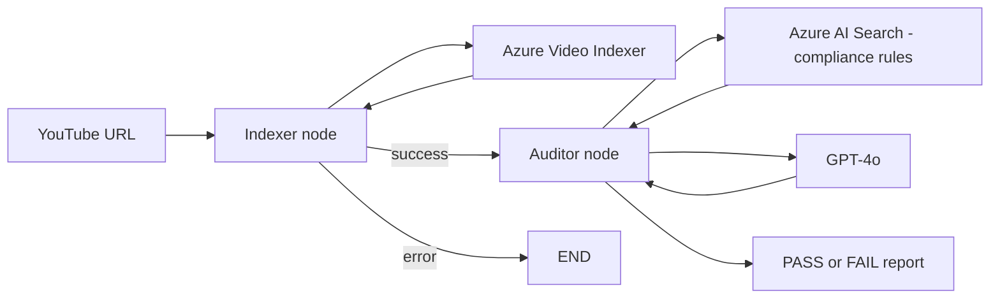

# Brand Guardian AI

A multi-modal compliance auditor for video content. Give it a YouTube URL and it transcribes the video, reads the on-screen text, retrieves the relevant advertising and disclosure rules, and returns a structured PASS / FAIL report with each violation, its severity and its category.

Built with **LangGraph**, **Azure Video Indexer**, **Azure AI Search (RAG)**, **Azure OpenAI (GPT-4o)** and **FastAPI**.

## How it works



1. **Indexer node** downloads the video (yt-dlp), uploads it to Azure Video Indexer, polls until processing finishes, and extracts the transcript, on-screen text (OCR) and metadata.
2. **Conditional edge** sends the graph straight to `END` if indexing failed, so no paid LLM call is made on empty data.
3. **Auditor node** embeds the video content as a query, retrieves the 3 most relevant rule chunks from Azure AI Search, and asks GPT-4o to return violations as a JSON array.
4. **Plain Python code** (not the LLM) turns the violations into the final PASS / FAIL status and report.

The compliance rules live in PDFs (`backend/data/`), so supporting a new policy means adding a document and re-indexing, not changing code.

## Tech stack

Python 3.12 · uv · LangGraph · LangChain · Azure OpenAI (gpt-4o, text-embedding-3-small) · Azure AI Search · Azure Video Indexer · yt-dlp · FastAPI · Uvicorn

## Project structure

```
brand-guardian-ai/
├── main.py                        # CLI runner
├── .env.example                   # required settings (copy to .env)
├── backend/
│   ├── data/                      # compliance PDFs (the knowledge base)
│   ├── scripts/
│   │   └── index_documents.py     # PDFs -> chunks -> embeddings -> Azure AI Search
│   └── src/
│       ├── api/server.py          # FastAPI app (/audit, /health)
│       ├── graph/
│       │   ├── state.py           # shared graph state
│       │   ├── nodes.py           # Indexer and Auditor nodes
│       │   └── workflow.py        # graph wiring + conditional edge
│       └── services/
│           └── video_indexer.py   # Azure Video Indexer client
└── pyproject.toml
```

## Setup

**Prerequisites:** Python 3.12, [uv](https://docs.astral.sh/uv/), the Azure CLI, and these Azure resources:

- Azure OpenAI with `gpt-4o` and `text-embedding-3-small` deployments
- Azure AI Search
- Azure Video Indexer (ARM-based account with a connected storage account)

**Permissions:** your signed-in Azure user needs *Contributor* on the Video Indexer resource. The Video Indexer's managed identity needs *Storage Blob Data Contributor* on its storage account.

```bash
git clone https://github.com/Arun199831/brand-guardian-ai.git
cd brand-guardian-ai
uv sync
az login
```

Copy `.env.example` to `.env` and fill in your values.

## Usage

**1. Index the compliance rules (once):**

```bash
uv run python backend/scripts/index_documents.py
```

**2a. Audit a video from the command line:**

```bash
uv run python main.py "https://youtube.com/shorts/<video-id>"
```

**2b. Or run the API:**

```bash
uv run uvicorn backend.src.api.server:app --port 8000
```

Open `http://127.0.0.1:8000/docs`, then call `POST /audit` with:

```json
{"video_url": "https://youtube.com/shorts/<video-id>"}
```

Example response (shortened):

```json
{
  "video_id": "vid_f5762a92",
  "status": "FAIL",
  "final_report": "Found 5 violation(s): 2 high, 3 medium, 0 low. ...",
  "compliance_results": [
    {
      "category": "Length",
      "description": "Video duration is 9 seconds, which is below the minimum 10 seconds required for YouTube views to count.",
      "severity": "high",
      "timestamp": null
    }
  ],
  "errors": []
}
```

A video takes about 3 minutes to process, almost all of it Video Indexer.

## Design decisions

- **Code decides PASS / FAIL.** The LLM only lists violations; deterministic code computes the verdict.
- **Nodes never crash the graph.** Every failure path returns an error in the state plus a FAIL status, and the graph routes around a failed indexer.
- **Safe long-running calls.** Polling has a time ceiling, every request has a timeout, uploads have a longer one, and temp files are unique per request and always cleaned up.
- **No stored secrets for Video Indexer.** Authentication goes through `DefaultAzureCredential` (ARM token exchange), not a stored key.
- **Bounded RAG query.** Transcript and OCR text are truncated before embedding to stay within token limits.
- **Blocking work in a plain `def` endpoint**, so FastAPI runs each audit in a worker thread instead of freezing the event loop.

## Known limitations

- **Rules define the scope.** The knowledge base holds YouTube ad specs and the FTC influencer-disclosure guide. Content outside those documents, such as profanity, is not flagged.
- **Spec rules are hard to verify.** Technical limits (resolution, formats, character counts) can be misapplied to text that is not an ad headline, and results vary between runs of the same video.
- **Re-running the indexer duplicates chunks.** Delete the index before re-indexing.
- **No authentication or job queue.** `/audit` is synchronous and unauthenticated, which suits a demo but not production.
- **Logging only.** There is no tracing, metrics or automated evaluation set yet.
- `langchain-community` is being phased out, so the Azure Search vector store should move to a standalone package.

## Future work

- Evaluation set of videos with expected verdicts, to measure precision and recall
- Brand-safety rules document (profanity, hate speech, graphic content)
- Background jobs with status polling instead of a blocking endpoint
- Tracing with LangSmith or Azure Monitor
- Dockerfile and deployment